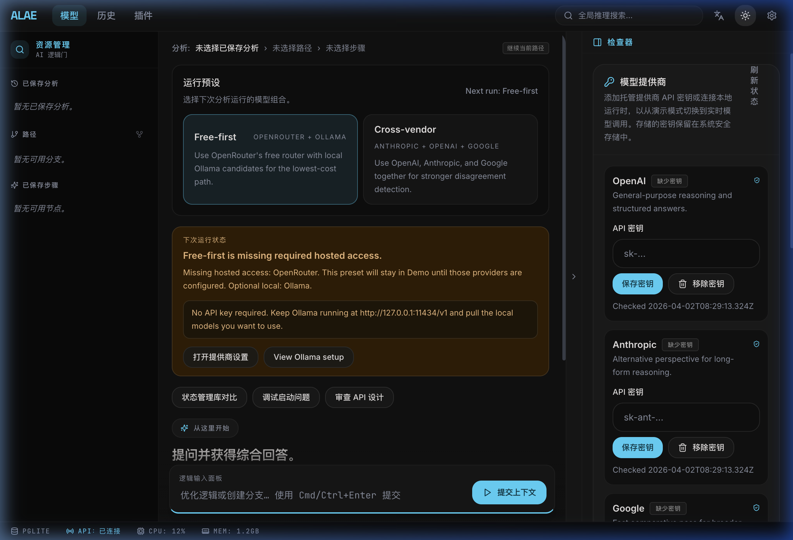

# Alae - Local-First AI Reasoning Workstation



**Alae** is a high-performance, local-first AI reasoning workstation built for developers and researchers. Designed with a professional 3-column IDE-like interface, it provides a secure, privacy-focused, and highly optimized environment for AI-assisted development.

## ✨ Key Features

- **Local-First Architecture:** Secure, local state management using PGlite, ensuring your data and conversations stay on your machine.
- **Multi-Model Concurrency:** Seamlessly interact with leading enterprise models from Anthropic, Google, and OpenAI.
- **Professional IDE UI:** A sleek, comprehensive 3-column layout equipped with global dark mode and smooth micro-animations.
- **Zod-Driven Contracts:** Robust schema validations guaranteeing reliable and predictable AI reasoning outputs.
- **Blazing Fast Desktop App:** Powered by Tauri and Rust for native desktop performance, ensuring minimal resource footprint.
- **Global Ready:** Built-in Internationalization (i18n) for multiple languages out of the box.


## 🚀 Quick Start

### Prerequisites

- [Node.js](https://nodejs.org/) (v18 or higher)
- [Rust & Cargo](https://www.rust-lang.org/tools/install) (required for Tauri)

### Installation

```bash
# Clone the repository
git clone https://github.com/yourusername/alae.git
cd alae

# Install frontend dependencies
npm install

# Build and launch the Tauri desktop application
npm run tauri dev
```

## 🛠 Tech Stack

- **Desktop Framework:** [Tauri v2](https://v2.tauri.app/)
- **Frontend App:** React 19, [Vite](https://vitejs.dev/), [Tailwind CSS v4](https://tailwindcss.com/)
- **State & Storage:** [Zustand](https://zustand-demo.pmnd.rs/), [PGlite](https://pglite.dev/)
- **AI Integration:** [Vercel AI SDK](https://sdk.vercel.ai/)
- **Validation:** [Zod](https://zod.dev/)

## 📄 License

This project is licensed under the **AGPL-3.0-only** License. See the `package.json` for details.
